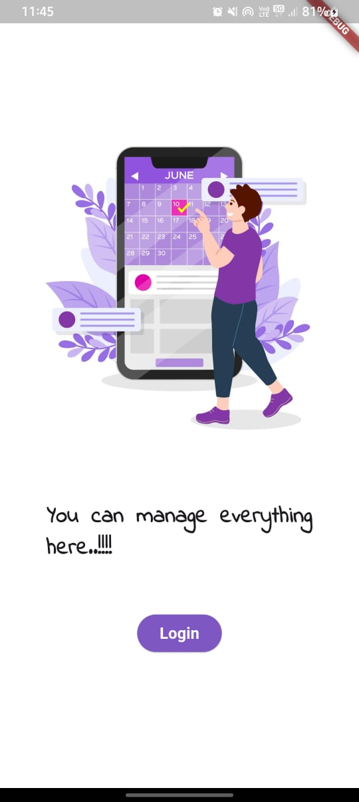
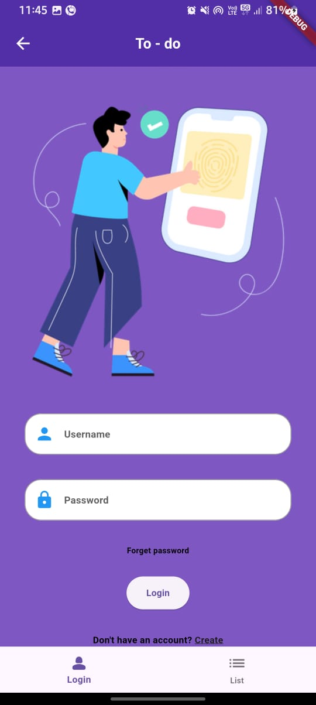
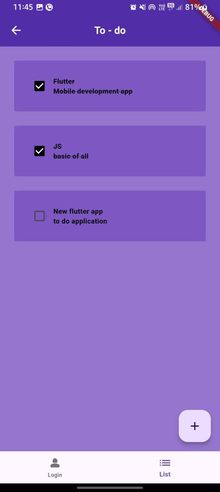
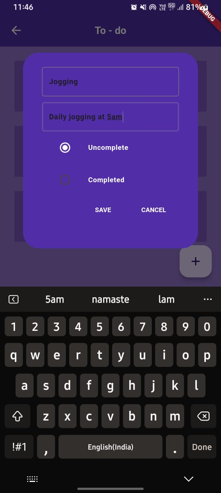
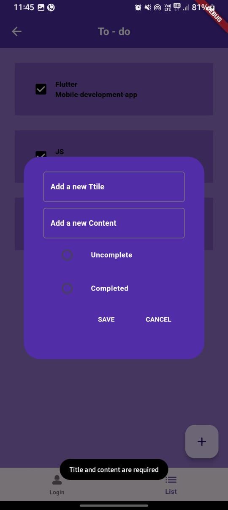
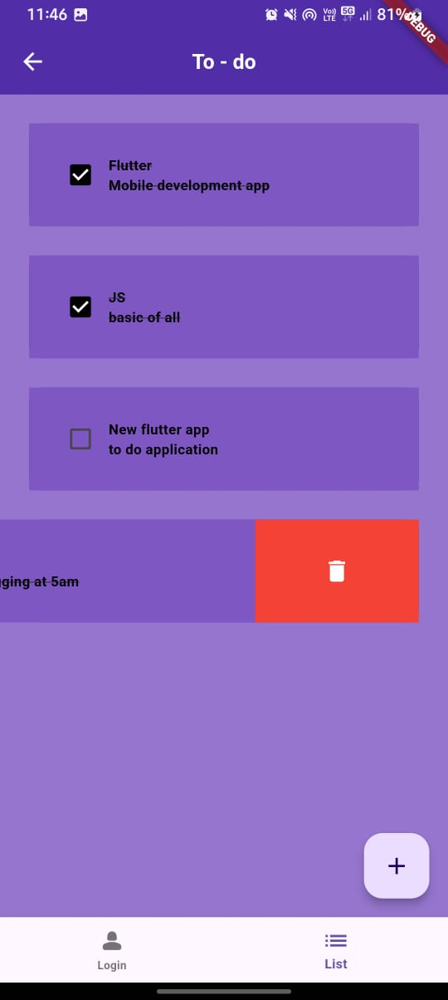

# TO - DO APPLICATION

A simple and efficient to-do application built with Flutter. This app features a clean UI, robust functionality, and the integration of Hive database for seamless data storage.

## Features

 - **Login Page:** Secure and intuitive login interface.
 - **Add New Tasks:** Add tasks with a status of completed or not completed.
 - **Valiations:** Validations for adding tasks have been implemented using fluttter toasts
 - **Task Status Management:** Easily update the completion status of tasks.
 - **Slidable Delete Option:** Swipe to delete tasks with a smooth sliding animation.
 - **Persistent Storage:** Tasks are stored locally using the Hive database for quick access and offline functionality.

## Package used

- Hive DB
- Flutter slidable
- Flutter toast

## Screenshots

